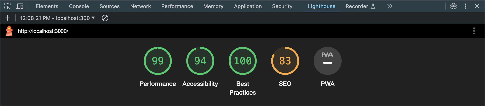

# Web Coding Challenge

The basic steps to install and run both the server and client parts of the web coding challenge.

## Getting Started

Follow these steps to set up and run the project.

### 1. Setup

First, navigate to the server directory and install dependencies:

```bash
cd server
npm install
cd client
npm install
npm run build
```

#### 2. Run the app

Run the following within the root of the repo.

```bash
npm start
```

Can see the client running in
http://localhost:3000/

## Notes

I wanted to leave some quick notes on the coding challenge as I wanted to give you my insights into why I choose certain patterns over others as well as improvements I would make if more time were spent.

### Decisions

#### TypeScript

As the lingua franca for React these days, I choose to install TypeScript as it makes it easier for me personally to locate any undefined values.

I would have done this in the BE as well if time permitted.

#### Architecture

I went with the structure we now see is getting more popular where we are using a folder per "feature" that holds the components, styles, and types used only by that feature.

Anything that would technically be shared in a larger application, is in the `common` folder.

I think it makes it easier to locate what is needed.

#### Composition pattern in React

The pattern I used in the Todo component is fairly uncommon among React developers as it uses functional programming but with JSX. We all are familiar with composition and passing functions to functions, but in React we usually see a pattern with JSX that looks more like HTML: we nest tags in between other tags.

I want you to know that the choice was intentional as it allows us to create a "controller" component that will pass state and functions without any or minimal prop-drilling. This is what you will see in the `Todo` component and how we pass components as props.

I'm not married to the idea of using composition, but I wanted to share a different perspective that perhaps is a bit interesting. Professionally, I code by team standards.

#### Data structure

I choose a JSON-type structure we usually see as a response from API:s. In this case, we are returning the todos as an array of objects.

Now, to be honest, I would probably rather have it flattened if I did this a second time. I would have then applied that data structure both in the BE and FE as it makes state updates easier and no need for traversals in a tree structure. For a reactive library such as React, this would make things easier when updating the application state.

#### Event listeners

Oh, man! I have worked on a few applications where tens of thousands of event listeners slowed the application down. It is usually caused in React applications by passing event listeners to all the list items instead of using event bubbling. In other cases, it can be by JS styling libraries that add styling inline based on JS event.

Therefore, we can see in the Todo component that I'm trying to use event bubbling as much as possible. Instead of using 5-6 even handlers per list item, we are using just one on the parent list. To be able to pass the data we need, I passed the data to the items via dataset properties.

### Lighthouse results

I was more focused on performance. Lighthouse gave a final result of 99/100 after building the project. Now, I could spend another ~hour going through what makes it 99% and not 100% as well as fixing the accessibility and SEO scores. However, I think that defeats the purpose of this exercise.



